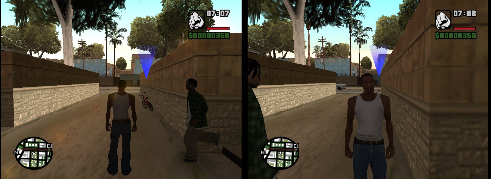

  <picture>
    <source media="(prefers-color-scheme: dark)" srcset="docs/img/logo.png">
    
  </picture>

  
  

  

  <b>This mod needs a legitimately owned copy of Grand Theft Auto: San Andreas.</b>
  <a href="https://store.rockstargames.com/fr/game/buy-grand-theft-auto-the-trilogy">Buy it on the Rockstar Store</a> (also on Steam). No game data is included here.

> [!WARNING]
> **PRE-ALPHA.** This is the very beginning of the project. Right now two players (up to four) see each other walk
> and run in the same city, and that is all. No vehicles, no shared missions, no combat, no co-op menu yet.
> Do not expect a playable co-op campaign today: it is being built, step by step.

  

<i>Two instances side by side: each player sees the other (green shirt) running with the game's own animations.</i>

# SACoop — the San Andreas story in co-op (work in progress)

A co-op mod for **Grand Theft Auto: San Andreas** (PC, version 1.0 US), by the authors of
[VCCoop](https://github.com/Parricidium/VCCoop) (Vice City co-op). The goal is the same: one player hosts and plays
the story, friends join the same world and the same missions, with modern options on top.

*[Version française plus bas.](#version-française)*

## The launcher

`SACoop.exe` updates the mod by itself from this page on every start (no need to download the zip again), checks your
game version, and starts the game as host or guest. Options and release notes are in its tabs.

  

## What works in this pre-alpha

- Host and join over UDP (default port 7800), up to 4 players.
- Each player sees the others as **CJ wearing that player's own clothes** (shops and wardrobe included), walking,
  running and sprinting with the game's animations, in the right place. A pedestrian model can be picked instead.
- **Shared vehicles**: whoever drives a car sends it to the others, who see it move with that player's CJ at the
  wheel (or as a passenger). Getting into someone else's car and driving off hands it over to you.
- Each player's **name above their head** and a **radar blip** in their colour.
- **Same time and weather** for everybody (the host's).
- The pause menu no longer freezes the world while other players are connected, and switching windows does not
  pause the game.
- Windowed or borderless play, fixed frame rate (30 by default), logos and intro videos skipped.
- Settings and saves kept in the game folder, apart from your solo saves.
- Two copies of the game can run on the same PC (the game normally refuses).

## Not there yet (roadmap)

1. Vehicles, the rest: enter / exit animations for the other players, damage, radio, lights, sirens.
2. Weapons, shots and damage.
3. Shared story missions (the host runs them, everybody plays them), the approach that works in VCCoop.
4. Shared traffic and pedestrians.
5. A co-op menu in the game, and a lobby in the launcher.
6. Modern rendering options (as in VCCoop), all optional.

## Installation

1. You need GTA San Andreas **1.0 US**. The current Steam version (3.0) must be downgraded first (a downgrader tool
   does it). The mod refuses to run on any other version.
2. Copy the contents of the zip into the game folder, next to `gta_sa.exe`, then run **`SACoop.exe`**. It keeps
   itself and the mod up to date: everybody ends up on the same version without downloading anything again.
3. The host clicks **HOST**. The others type the host's IP address and click **JOIN**.
4. Everybody starts a new game. Over the Internet, the host opens UDP port 7800 on their router, or you use a
   virtual LAN.

Uninstall: delete `dinput8.dll`, `SACoop.exe`, the `SACoop` folder, `sacoop*.ini`, `sacoop.log` and `logs\`.

## Building

Visual Studio 2022 Build Tools (x86, `/MT`), nothing else: `build.cmd` compiles `src\*.cpp` into
`build\dinput8.dll` and the launcher into `build\SACoop.exe` (`launcher\make-art.ps1` draws its background and icon). `dist\make-release.ps1 -Version <v>` builds and packs the zip. `run\` holds the two-instance
test scripts, `re\` the command-line Ghidra tools used to read the game.

The game executable and any decompiled code are **not** in this repository.

## Credits and license

- San Andreas 1.0 US addresses: read with Ghidra in the game executable, cross-checked with
  [plugin-sdk](https://github.com/DK22Pac/plugin-sdk) (DK22Pac).
- Grand Theft Auto and San Andreas are trademarks of Rockstar Games / Take-Two Interactive. This is an unofficial,
  non-commercial fan project, not affiliated with them. You must own the game.
- License: not chosen yet.

---

# Version française

> Il faut posséder une copie légitime de GTA San Andreas (rétrogradée en 1.0 US) : [l'acheter sur le Rockstar Store](https://store.rockstargames.com/fr/game/buy-grand-theft-auto-the-trilogy) (aussi sur Steam). Aucun fichier du jeu n'est fourni.

> [!WARNING]
> **PRÉ-ALPHA.** C'est le tout début du projet. Pour l'instant, deux joueurs (jusqu'à quatre) se voient marcher et
> courir dans la même ville, et c'est tout. Pas encore de véhicules, de missions partagées, de combat ni de menu coop.
> Ne vous attendez pas à une campagne coop jouable aujourd'hui : elle se construit, étape par étape.

Un mod coop pour **Grand Theft Auto: San Andreas** (PC, version 1.0 US), par les auteurs de
[VCCoop](https://github.com/Parricidium/VCCoop) (Vice City en coop). Même objectif : un joueur héberge et joue
l'histoire, ses amis rejoignent le même monde et les mêmes missions, avec des options modernes en plus.

## Le lanceur

`SACoop.exe` met le mod à jour tout seul depuis cette page à chaque démarrage (plus besoin de retélécharger le zip),
vérifie la version du jeu et lance la partie en hôte ou en invité. Options et notes de version sont dans ses onglets.

## Ce qui marche dans cette pré-alpha

- Héberger et rejoindre en UDP (port 7800 par défaut), jusqu'à 4 joueurs.
- Chaque joueur voit les autres sous les traits de **CJ, habillé comme ce joueur** (magasins et garde-robe compris),
  qui marche, court et sprinte avec les animations du jeu, au bon endroit. On peut choisir un piéton à la place.
- **Véhicules partagés** : celui qui conduit envoie sa voiture aux autres, qui la voient rouler avec le CJ de ce
  joueur au volant (ou en passager). Monter dans la voiture d'un autre et partir avec vous la confie.
- Le **pseudo de chaque joueur au-dessus de sa tête** et un **point radar** à sa couleur.
- **Même heure et même météo** pour tout le monde (celles de l'hôte).
- Le menu Pause ne fige plus le monde tant que d'autres joueurs sont connectés, et changer de fenêtre ne met pas le
  jeu en pause.
- Jeu en fenêtre ou plein écran sans bordure, images par seconde fixes (30 par défaut), logos et vidéos d'ouverture
  sautés.
- Réglages et sauvegardes dans le dossier du jeu, à part de vos sauvegardes solo.
- Deux copies du jeu peuvent tourner sur le même PC (le jeu le refuse d'habitude).

## Pas encore là (feuille de route)

1. Véhicules, la suite : animations de montée / descente des autres joueurs, dégâts, radio, phares, sirènes.
2. Armes, tirs et dégâts.
3. Missions de l'histoire partagées (l'hôte les lance, tout le monde les joue) : la méthode qui marche dans VCCoop.
4. Circulation et passants partagés.
5. Un menu coop dans le jeu, et un salon dans le lanceur.
6. Options de rendu moderne (comme dans VCCoop), toutes facultatives.

## Installation

1. Il faut GTA San Andreas **1.0 US**. La version Steam actuelle (3.0) doit d'abord être rétrogradée (un outil de
   rétrogradation le fait). Le mod refuse de se lancer sur une autre version.
2. Copier le contenu du zip dans le dossier du jeu, à côté de `gta_sa.exe`, puis lancer **`SACoop.exe`**. Il se met
   à jour tout seul, avec le mod : tout le monde reste sur la même version sans rien retélécharger.
3. L'hôte clique sur **HÉBERGER**. Les autres tapent l'adresse IP de l'hôte et cliquent sur **REJOINDRE**.
4. Chacun commence une nouvelle partie. Par Internet, l'hôte ouvre le port UDP 7800 sur sa box, ou vous passez par
   un réseau virtuel.

Désinstaller : supprimer `dinput8.dll`, `SACoop.exe`, le dossier `SACoop`, `sacoop*.ini`, `sacoop.log` et `logs\`.

## Compiler

Visual Studio 2022 Build Tools (x86, `/MT`), aucune autre dépendance : `build.cmd` compile `src\*.cpp` en
`build\dinput8.dll` et le lanceur en `build\SACoop.exe` (`launcher\make-art.ps1` dessine son fond et son icône). `dist\make-release.ps1 -Version <v>` compile et assemble le zip. `run\` contient les scripts de
test à deux instances, `re\` les outils Ghidra en ligne de commande qui ont servi à lire le jeu.

L'exécutable du jeu et tout code décompilé ne sont **pas** dans ce dépôt.

## Crédits et licence

- Adresses de San Andreas 1.0 US : lues avec Ghidra dans l'exécutable du jeu, recoupées avec
  [plugin-sdk](https://github.com/DK22Pac/plugin-sdk) (DK22Pac).
- Grand Theft Auto et San Andreas sont des marques de Rockstar Games / Take-Two Interactive. Projet de fan, non
  officiel, non commercial, sans lien avec eux ; il faut posséder le jeu.
- Licence : pas encore choisie.
