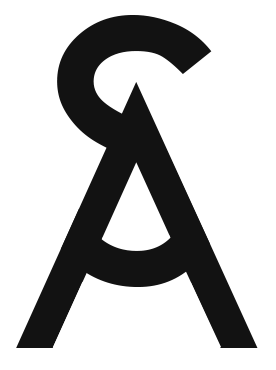
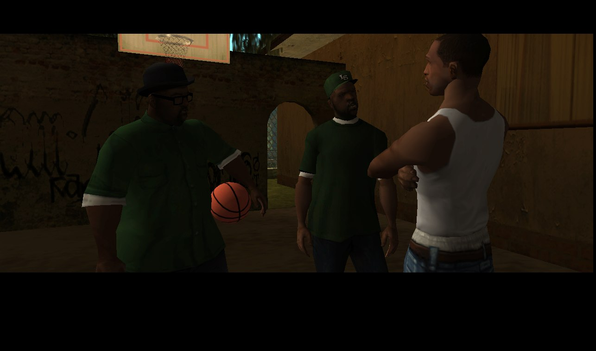
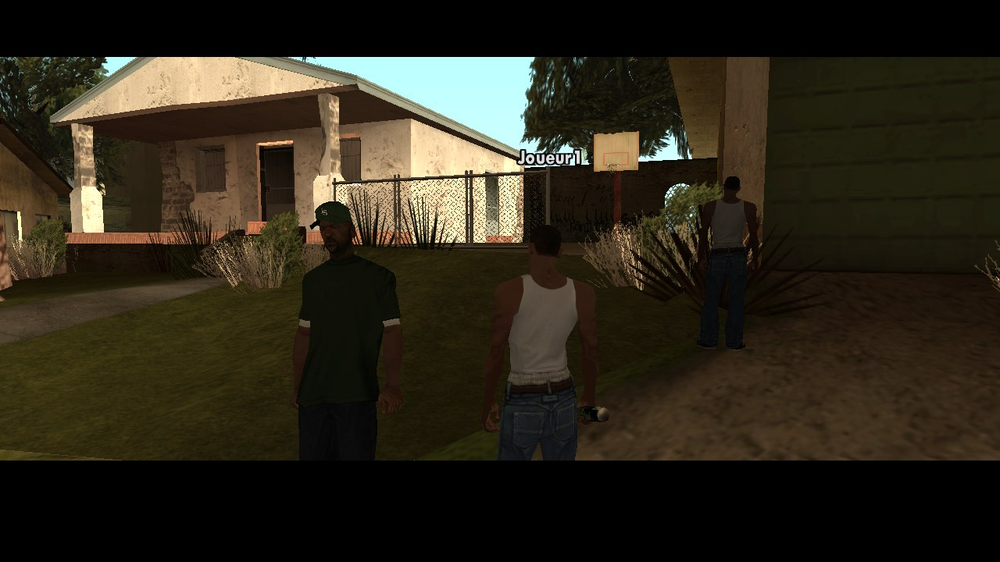
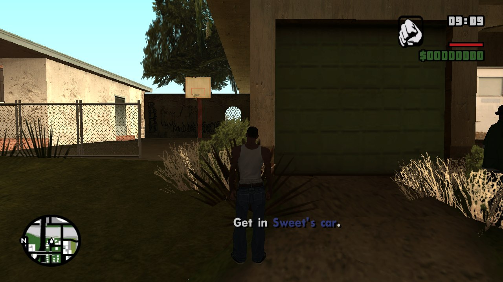
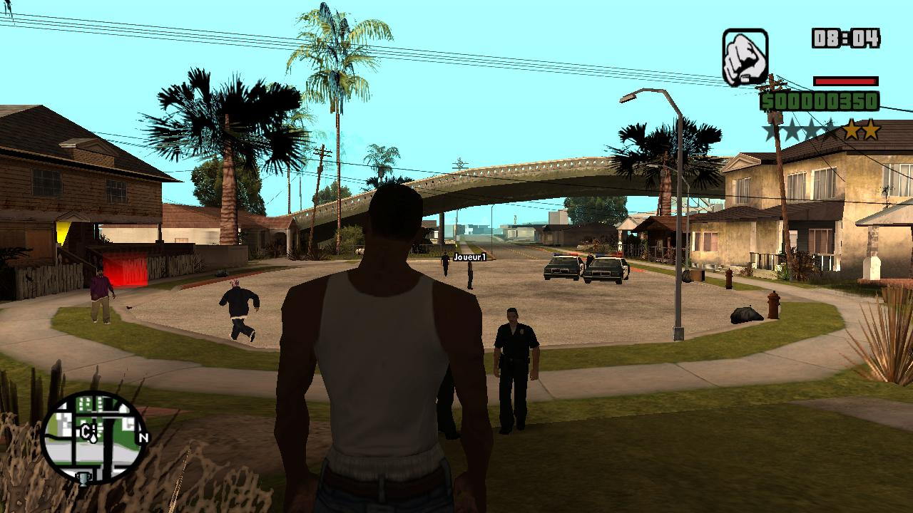
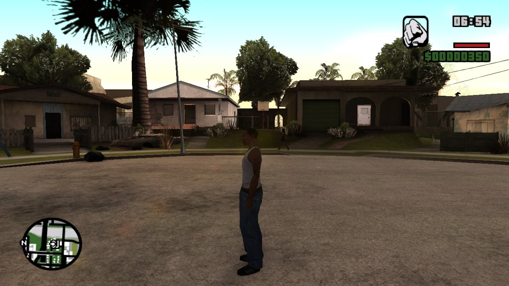
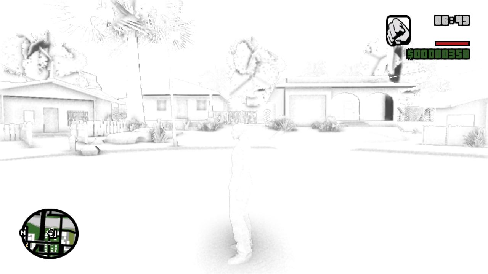
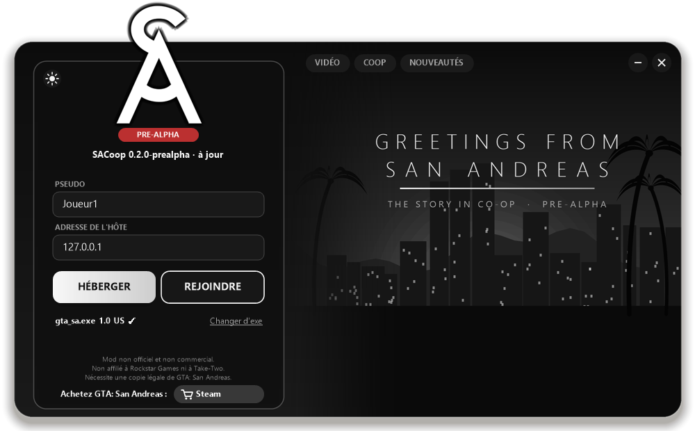
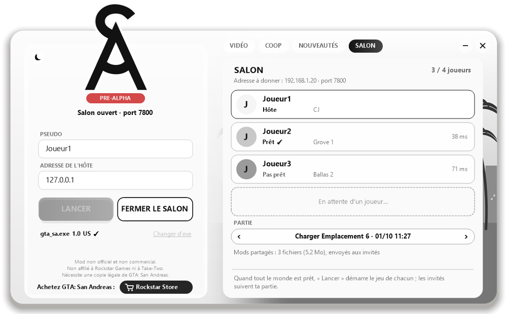

  <picture>
    <source media="(prefers-color-scheme: dark)" srcset="docs/img/logo.png">
    
  </picture>

  
  

  

  <b>This mod needs a legitimately owned copy of Grand Theft Auto: San Andreas.</b>
  <a href="https://store.rockstargames.com/fr/game/buy-grand-theft-auto-the-trilogy">Buy it on the Rockstar Store</a> (also on Steam). No game data is included here.

> [!WARNING]
> **PRE-ALPHA.** Shared story missions, vehicles, combat and saves already work, but the mod has not been played
> for real between friends yet. Expect bugs, and send your logs (`sacoop.log`, `logs` folder).

  

<i>A guest watches the cutscene of the host's mission (Big Smoke), at the same time as the host.</i>

  
  

<i>On the guest: the mission camera with Sweet and the host ("Joueur1"), then the mission's own texts, in widescreen.</i>

  

<i>A wanted guest: the host's cops come for them too (Grove Street).</i>

  
  

<i>Optional modern rendering: ambient occlusion and FXAA (right: the occlusion alone).</i>

# SACoop — the San Andreas story in co-op (work in progress)

A co-op mod for **Grand Theft Auto: San Andreas** (PC, version 1.0 US), by the authors of
[VCCoop](https://github.com/Parricidium/VCCoop) (Vice City co-op). The goal is the same: one player hosts and plays
the story, friends join the same world and the same missions, with modern options on top.

*[Version française plus bas.](#version-française)*

## The launcher

`SACoop.exe` updates the mod by itself from this page on every start (no need to download the zip again), checks your
game version, and starts the game as host or guest. Its tabs hold the lobby, your outfit (3D preview), your mods (on/off,
3D preview), the options and the release notes; the round button at the top right of the left panel opens the logs of your last 50 sessions (to send
when something goes wrong).

**Lobby**: HOST opens a lobby; the others JOIN it with the host's address and click READY. The host picks a new game
or one of their saves, then START launches everybody's game at once (sounds when a player joins, leaves or gets
ready).

  
  

## What works in this pre-alpha

- Host and join over UDP (default port 7800), up to 4 players.
- Each player sees the others as **CJ wearing that player's own clothes** (shops and wardrobe included), walking,
  running and sprinting with the game's animations, in the right place. A pedestrian model can be picked instead.
- **Shared vehicles**: whoever drives a car sends it to the others, who see it move with that player's CJ at the
  wheel (or as a passenger). Getting into someone else's car and driving off hands it over to you.
  Everybody sees the others open the door and get in or out, and the car's damage (doors, bumpers, lights,
  tyres, smoke, fire, explosion), siren and repairs.
- Each player's **name above their head** and a **radar blip** in their colour.
- **Same time and weather** for everybody (the host's).
- **Mission vehicles for everybody**: when the host takes a mission vehicle (the bikes of Big Smoke's mission...),
  each guest nearby with no free seat in it gets the same vehicle next to them (or a reminder to ride along with G).
- **Police for everybody**: one wanted level for the group (the highest; losing the police clears it for all), and
  the host's cops also hunt down wanted guests near the host (their hits land on the guest).
- **Merged street life**: the host populates the streets around them (110 m) and everybody sees the same
  pedestrians and traffic there; further out, the nearest player populates. A guest a bit away from the host keeps
  live streets on their side, with nothing doubled or vanishing in front of anyone.
- **Weapons and shots**: everybody sees the weapon in each player's hand and their shots. Players can hurt each
  other (bullets, punches, cars; *Friendly fire* option, each player chooses), and a player who dies falls for
  everybody, then comes back at the hospital.
- **Shared story missions**: missions run on the host, everybody plays them. The other players see the mission
  characters (Sweet, Big Smoke... with their weapons, in their cars), vehicles and objects, the **cutscenes** (skipped
  together when the host skips), mission texts,
  help boxes, radar markers, dialogues, fades and mission cameras. They can fight alongside the host: their hits on
  mission characters count, and mission enemies hurt them. **Any player can move the mission on**: reaching a
  checkpoint or getting into the mission car counts for everybody, and checkpoint markers show for all. At mission
  start, far-away players are brought behind the host. **Shared story progress**: what the host's missions unlock
  is sent to everybody, and money earned in missions goes to each player. A player joining in the middle of a
  mission gets its markers and texts. **Shared save**: when the host saves, the save goes to every player's same slot. Side activities stay local to each player.
- The pause menu no longer freezes the world while other players are connected, and switching windows does not
  pause the game.
- **Shared mods**: put car, weapon or character mods (`.dff`, `.txd`, handling lines...) in `SACoop\mods`; the host
  sends them to the guests in the launcher lobby, and everybody plays with the host's mods.
- **COOP menu in the game** (main and pause menus): host, join an address, change your name, see the session.
- **G**: ride as a passenger in another player's car (F too). **T**: chat (Enter to send; `/join` brings you back next to the host). **F5** (held): players board (name, health, distance). **F6**: first-person view on foot. **F10**: in-game menu, used with the mouse: players (go to a player, friendly fire), vehicles (3D thumbnails, a click
  spawns it in front of you), tools (health and armour, weapons, money, repair, clear wanted level, jetpack), outfit,
  and for the host world (time, weather) and host settings. **F1**: help (keys, tips).
- **Modern rendering** (optional): ambient occlusion (corners, wall bases, under cars darker) and FXAA anti-aliasing.
- **Widescreen**: the 3D, the HUD (radar, icons, texts) and the menus keep their proportions on wide screens, with a wider field
  of view (Hor+). Borderless mode picks your screen's resolution by itself.
- Windowed or borderless play, fixed frame rate (30 by default), logos and intro videos skipped.
- Settings and saves kept in the game folder, apart from your solo saves.
- Two copies of the game can run on the same PC (the game normally refuses).

## Not there yet (roadmap)

1. Story missions, the rest: testing every mission (the real test with JD and friends).
2. Police cars ramming guests' cars (cops on foot already chase them).
3. More modern rendering (sun shadows, reflections, as in VCCoop), all optional.

## Installation

1. You need GTA San Andreas **1.0 US**. The current Steam version (3.0) must be downgraded first (a downgrader tool
   does it). The mod refuses to run on any other version.
2. Copy the contents of the zip into the game folder, next to `gta_sa.exe`, then run **`SACoop.exe`**. It keeps
   itself and the mod up to date: everybody ends up on the same version without downloading anything again.
3. The host clicks **HOST** (it opens the lobby). The others type the host's IP address, click **JOIN**, then
   **READY**.
4. The host picks a new game or a save and clicks **START**: every game starts, guests follow the host (same save
   when they have it). Over the Internet, the host opens port 7800 (TCP and UDP) on their router, or you use a
   virtual LAN. A player who arrives after the start uses **JOIN IN GAME**.

Uninstall: delete `dinput8.dll`, `SACoop.exe`, the `SACoop` folder, `sacoop*.ini`, `sacoop.log` and `logs\`.

## Building

Visual Studio 2022 Build Tools (x86, `/MT`), nothing else: `build.cmd` compiles `src\*.cpp` into
`build\dinput8.dll` and the launcher into `build\SACoop.exe` (`launcher\make-art.ps1` draws its background and icon). `dist\make-release.ps1 -Version <v>` builds and packs the zip. `run\` holds the two-instance
test scripts, `re\` the command-line Ghidra tools used to read the game.

The game executable and any decompiled code are **not** in this repository.

## Credits and license

- San Andreas 1.0 US addresses: read with Ghidra in the game executable, cross-checked with
  [plugin-sdk](https://github.com/DK22Pac/plugin-sdk) (DK22Pac).
- Grand Theft Auto and San Andreas are trademarks of Rockstar Games / Take-Two Interactive. This is an unofficial,
  non-commercial fan project, not affiliated with them. You must own the game.
- License: not chosen yet.

---

# Version française

> Il faut posséder une copie légitime de GTA San Andreas (rétrogradée en 1.0 US) : [l'acheter sur le Rockstar Store](https://store.rockstargames.com/fr/game/buy-grand-theft-auto-the-trilogy) (aussi sur Steam). Aucun fichier du jeu n'est fourni.

> [!WARNING]
> **PRÉ-ALPHA.** Les missions de l'histoire partagées, les véhicules, le combat et les sauvegardes marchent déjà,
> mais le mod n'a pas encore été joué pour de vrai entre amis. Attendez-vous à des bugs, et envoyez vos journaux
> (`sacoop.log`, dossier `logs`).

Un mod coop pour **Grand Theft Auto: San Andreas** (PC, version 1.0 US), par les auteurs de
[VCCoop](https://github.com/Parricidium/VCCoop) (Vice City en coop). Même objectif : un joueur héberge et joue
l'histoire, ses amis rejoignent le même monde et les mêmes missions, avec des options modernes en plus.

## Le lanceur

`SACoop.exe` met le mod à jour tout seul depuis cette page à chaque démarrage (plus besoin de retélécharger le zip),
vérifie la version du jeu et lance la partie en hôte ou en invité. Ses onglets : le salon, votre tenue (aperçu 3D), vos
mods (activer / désactiver, aperçu 3D), les options et les notes de version ; le bouton rond en haut à droite du panneau de gauche ouvre les
journaux de vos 50 dernières parties (à envoyer en cas de souci).

**Salon** : HÉBERGER ouvre un salon ; les autres le REJOIGNENT avec l'adresse de l'hôte et cliquent sur PRÊT. L'hôte
choisit une nouvelle partie ou une de ses sauvegardes, puis LANCER démarre le jeu de tout le monde d'un coup (sons
quand un joueur arrive, part ou se met prêt).

## Ce qui marche dans cette pré-alpha

- Héberger et rejoindre en UDP (port 7800 par défaut), jusqu'à 4 joueurs.
- Chaque joueur voit les autres sous les traits de **CJ, habillé comme ce joueur** (magasins et garde-robe compris),
  qui marche, court et sprinte avec les animations du jeu, au bon endroit. On peut choisir un piéton à la place.
- **Véhicules partagés** : celui qui conduit envoie sa voiture aux autres, qui la voient rouler avec le CJ de ce
  joueur au volant (ou en passager). Monter dans la voiture d'un autre et partir avec vous la confie.
  Chacun voit les autres ouvrir la portière, monter et descendre, et les dégâts de la voiture (portières,
  pare-chocs, phares, pneus, fumée, feu, explosion), sa sirène et ses réparations.
- Le **pseudo de chaque joueur au-dessus de sa tête** et un **point radar** à sa couleur.
- **Même heure et même météo** pour tout le monde (celles de l'hôte).
- **Véhicules de mission pour tous** : quand l'hôte prend un véhicule de mission (les vélos de la mission de Big
  Smoke...), chaque invité proche sans place libre dedans reçoit le même véhicule à côté de lui (sinon un rappel : G
  pour monter avec lui).
- **Police pour tous** : un seul niveau de recherche pour le groupe (le plus haut ; semer la police l'efface pour
  tous), et les policiers de l'hôte traquent aussi les invités recherchés près de lui (leurs coups arrivent chez
  l'invité).
- **Rues fusionnées** : l'hôte peuple les rues autour de lui (110 m) et tout le monde y voit les mêmes passants et la
  même circulation ; plus loin, c'est le joueur le plus proche qui peuple. Un invité un peu éloigné de l'hôte garde
  des rues vivantes de son côté, sans rien en double ni rien qui disparaisse sous les yeux.
- **Armes et tirs** : chacun voit l'arme en main des autres joueurs et leurs tirs. Les joueurs peuvent se blesser
  (balles, coups, voitures ; option *Tir ami*, chacun choisit pour lui), et un joueur qui meurt tombe chez tout le
  monde, puis revient à l'hôpital.
- **Missions de l'histoire partagées** : elles tournent chez l'hôte, tout le monde les joue. Les autres voient les
  personnages de mission (Sweet, Big Smoke... avec leurs armes, dans leurs voitures), les véhicules et les objets,
  les **cinématiques** (passées ensemble quand l'hôte les passe), textes de mission, aides, marqueurs radar, dialogues, fondus et caméras de mission. Ils peuvent
  se battre avec l'hôte : leurs coups sur les personnages de mission comptent, et les ennemis de mission les
  blessent. **N'importe quel joueur fait avancer la mission** : atteindre un
  point de passage ou monter dans la voiture de mission compte pour tous, et les marqueurs s'affichent chez tous.
  Au début d'une mission, les joueurs éloignés sont ramenés derrière l'hôte. **Progression partagée** : ce que débloquent les missions
  de l'hôte est envoyé à tous, et l'argent gagné en mission va à chacun. Un joueur qui arrive en cours de mission en
  reçoit les marqueurs et les textes. **Sauvegarde partagée** : quand l'hôte sauvegarde, la sauvegarde arrive chez
  chaque joueur, au même emplacement. Les activités annexes restent locales à chacun.
- Le menu Pause ne fige plus le monde tant que d'autres joueurs sont connectés, et changer de fenêtre ne met pas le
  jeu en pause.
- **Mods partagés** : posez vos mods de voitures, d'armes ou de personnages (`.dff`, `.txd`, lignes de handling...)
  dans `SACoop\mods` ; l'hôte les envoie aux invités dans le salon du lanceur, et tout le monde joue avec ses mods.
- **Menu COOP dans le jeu** (menus principal et pause) : héberger, rejoindre une adresse, changer de pseudo, voir la
  session.
- **G** : monter en passager dans la voiture d'un autre joueur (F aussi). **T** : tchat (Entrée pour envoyer ; `/rejoindre` vous ramène près de l'hôte). **F5** (maintenue) : tableau des joueurs (pseudo, vie, distance). **F6** : vue à la première personne à pied. **F10** : menu en jeu, à la souris : joueurs (aller vers un
  joueur, tir ami), véhicules (vignettes 3D, un clic le fait apparaître devant vous), outils (santé et gilet, armes,
  argent, réparer, étoiles à zéro, jetpack), tenue, et pour l'hôte monde (heure, météo) et réglages d'hôte. **F1** : aide
  (touches, bon à savoir).
- **Rendu moderne** (facultatif) : occlusion ambiante (coins, pieds des murs, dessous des voitures assombris) et
  anticrénelage FXAA.
- **Grand écran** : la 3D, le HUD (radar, icônes, textes) et les menus gardent leurs proportions sur un écran large, avec un champ
  de vision élargi. En plein écran sans bordure, la résolution de l'écran est choisie toute seule.
- Jeu en fenêtre ou plein écran sans bordure, images par seconde fixes (30 par défaut), logos et vidéos d'ouverture
  sautés.
- Réglages et sauvegardes dans le dossier du jeu, à part de vos sauvegardes solo.
- Deux copies du jeu peuvent tourner sur le même PC (le jeu le refuse d'habitude).

## Pas encore là (feuille de route)

1. Missions de l'histoire, la suite : essai de chaque mission (le vrai test entre amis).
2. Voitures de police qui éperonnent celle d'un invité (les policiers à pied le poursuivent déjà).
3. Plus de rendu moderne (ombres du soleil, reflets, comme dans VCCoop), tout facultatif.

## Installation

1. Il faut GTA San Andreas **1.0 US**. La version Steam actuelle (3.0) doit d'abord être rétrogradée (un outil de
   rétrogradation le fait). Le mod refuse de se lancer sur une autre version.
2. Copier le contenu du zip dans le dossier du jeu, à côté de `gta_sa.exe`, puis lancer **`SACoop.exe`**. Il se met
   à jour tout seul, avec le mod : tout le monde reste sur la même version sans rien retélécharger.
3. L'hôte clique sur **HÉBERGER** (cela ouvre le salon). Les autres tapent l'adresse IP de l'hôte, cliquent sur
   **REJOINDRE**, puis sur **PRÊT**.
4. L'hôte choisit une nouvelle partie ou une sauvegarde et clique sur **LANCER** : tous les jeux démarrent, les
   invités suivent l'hôte (même sauvegarde s'ils l'ont). Par Internet, l'hôte ouvre le port 7800 (TCP et UDP) sur
   sa box, ou vous passez par un réseau virtuel. Un joueur qui arrive après le lancement passe par
   **REJOINDRE EN JEU**.

Désinstaller : supprimer `dinput8.dll`, `SACoop.exe`, le dossier `SACoop`, `sacoop*.ini`, `sacoop.log` et `logs\`.

## Compiler

Visual Studio 2022 Build Tools (x86, `/MT`), aucune autre dépendance : `build.cmd` compile `src\*.cpp` en
`build\dinput8.dll` et le lanceur en `build\SACoop.exe` (`launcher\make-art.ps1` dessine son fond et son icône). `dist\make-release.ps1 -Version <v>` compile et assemble le zip. `run\` contient les scripts de
test à deux instances, `re\` les outils Ghidra en ligne de commande qui ont servi à lire le jeu.

L'exécutable du jeu et tout code décompilé ne sont **pas** dans ce dépôt.

## Crédits et licence

- Adresses de San Andreas 1.0 US : lues avec Ghidra dans l'exécutable du jeu, recoupées avec
  [plugin-sdk](https://github.com/DK22Pac/plugin-sdk) (DK22Pac).
- Grand Theft Auto et San Andreas sont des marques de Rockstar Games / Take-Two Interactive. Projet de fan, non
  officiel, non commercial, sans lien avec eux ; il faut posséder le jeu.
- Licence : pas encore choisie.
